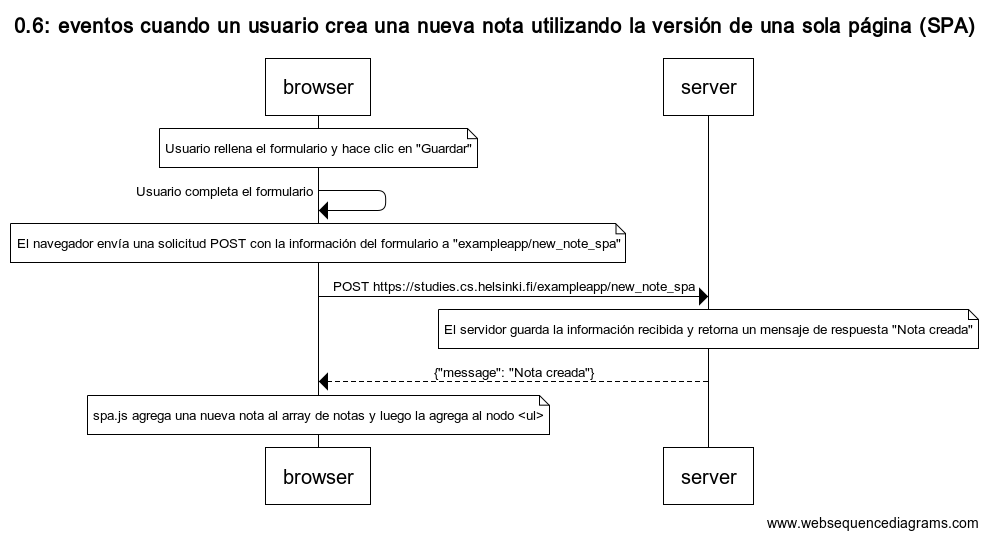

pagina para crear mis diagramas -> https://www.websequencediagrams.com/

Part 0: Fundamentos de las aplicaciones web

Este diagrama describe la situación en la que se crea una nueva nota en la página

# 0.4: Nueva nota

```
title 0.4: Nueva nota


    participant browser
    participant server

    note over browser
        El cliente agrega una nueva nota: "Hola desde Paraguay"
    end note

    browser->server: POST https://studies.cs.helsinki.fi/exampleapp/new_note

    note over server
        El servidor guarda una nueva nota
    end note

    note over browser
        El método POST recarga el navegador, generando una nueva llamada al servidor
    end note

    browser->server: GET https://studies.cs.helsinki.fi/exampleapp/notes
    server-->browser: Código HTML
    browser->server: GET https://studies.cs.helsinki.fi/exampleapp/main.css
    server-->browser: main.css
    browser->server: GET https://studies.cs.helsinki.fi/exampleapp/main.js
    server-->browser: main.js

    note over browser
        El navegador comienza a ejecutar el código JavaScript
        que solicita datos JSON al servidor
    end note

    browser->server: GET https://studies.cs.helsinki.fi/exampleapp/data.json
    server-->browser: [{ contenido: "Hola desde Paraguay", fecha: "2024-03-24" }, ...]

    note over browser
        El navegador ejecuta el controlador de eventos
        que renderiza las notas para mostrarlas
    end note

```


# 0.5: Diagrama de aplicación de una sola página

Este diagrama describe la situación en la que el usuario accede a la versión de una sola página (SPA) de la aplicación de notas y cómo se obtienen y muestran los datos.

```
title 0.5: aplicación de una sola página


    participant browser
    participant server

    browser->server: GET https://studies.cs.helsinki.fi/exampleapp/spa
    server-->browser: Código HTML
    browser->server: GET https://studies.cs.helsinki.fi/exampleapp/main.css
    server-->browser: main.css
    browser->server: GET https://studies.cs.helsinki.fi/exampleapp/spa.js
    server-->browser: spa.js

    note over browser
        El navegador comienza a ejecutar el código JavaScript
        que solicita datos JSON al servidor
    end note

    browser->server: GET https://studies.cs.helsinki.fi/exampleapp/data.json
    server-->browser: [{"contenido":"hacer a América grande de nuevo!","fecha":"2022-05-10T14:31:13.201Z"}...]

    note over browser
        El navegador ejecuta el controlador de eventos
        que renderiza las notas para mostrarlas
    end note
```


# 0.6:Nueva nota en diagrama de aplicación de una sola pagina

Este diagrama representa el flujo de eventos cuando un usuario crea una nueva nota utilizando la versión de una sola página (SPA) de la aplicación

```
title 0.6: eventos cuando un usuario crea una nueva nota utilizando la versión de una sola página (SPA)


    participant browser
    participant server

    note over browser
        Usuario rellena el formulario y hace clic en "Guardar"
    end note

    browser->browser: Usuario completa el formulario

    note over browser
        El navegador envía una solicitud POST con la información del formulario a "exampleapp/new_note_spa"
    end note

    browser->server: POST https://studies.cs.helsinki.fi/exampleapp/new_note_spa

    note over server
        El servidor guarda la información recibida y retorna un mensaje de respuesta "Nota creada"
    end note

    server-->browser: {"message": "Nota creada"}

    note over browser
        spa.js agrega una nueva nota al array de notas y luego la agrega al nodo <ul>
    end note
```


